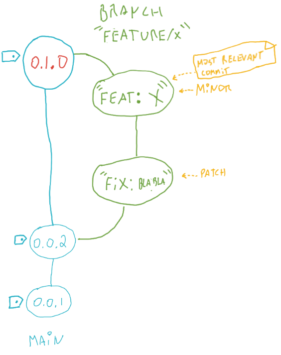

It allow to get the next version using conventional commit. 

### Input

```bash
   --path value,         -p value  path to git repository. i.e: /home/user/repo
   --sourceBranch value, -s value  source branch. i.e: 'feature/foo
   --targetBranch value, -t value  target branch. i.e: 'main   
```

#### Example:

```bash
nxtv --path /home/user/repo --sourceBranch feature/foo --targetBranch main
```

### Output

Por example: 
Imagine the next repository:



They have two branches:
- main: With two tags: 0.0.1 and 0.0.2
- feature/x: With two commits "feat: X" and "fix: blabla"

The commit with message "feat: X" indicates that the upgrade must be a feature (minor) upgrade.

Then the version is (0.1.0) and the output of the command is:

```json
{
  "versions": [
    "0.0.2",
    "0.0.1"    
  ],
  "latestVersion": "0.0.2",
  "relevantCommitMsg": "feat: X",
  "upgradeType": "minor",
  "nextVersion": "0.1.0"
}
```
